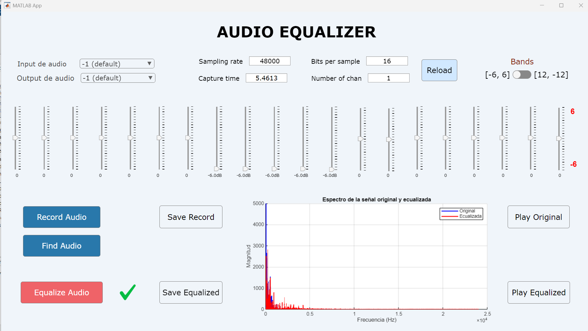

# Audio Equalizer

A real-time audio equalizer implementation using **MATLAB App Designer**.  
This application allows users to modify audio signals through frequency band adjustments using **wavelet transforms**.

## Features

- Load audio files (`.mp3`, `.wav`) or record directly using a microphone
- Save recorded audio with custom settings
- Adjustable audio parameters:
  - **Sampling Frequency (Fs)**  
  - **Bit Depth (r)**  
  - **Capture Time (Tc)**  
  - **Number of Channels (Nc)**
- Choose audio input and output devices (e.g. microphone, speakers)
- Visual display of both original and equalized spectra using Fourier Transform
- Adjustable gain sliders per frequency band (from `[-6, 6]` or customizable range like `[-12, 12]`)
- Apply equalization using **wavelet decomposition (db25)**
- Interactive UI built in **MATLAB R2024a**
- Exported equalized signal playback support
- Interface screenshot included (`ss/app.png`)

## Requirements

- MATLAB **R2019b** or later (**R2024a** recommended)
- Signal Processing Toolbox
- Wavelet Toolbox

## Installation

```bash
git clone https://github.com/asdcainicela/Audio-Equalizer.git
```

Then open MATLAB:

1. Navigate to the project folder.
2. Open `App.mlapp` in App Designer.

## Project Structure

```
Audio-Equalizer/
├── App.mlapp           # Main MATLAB App Designer GUI
├── AppMatlab.m         # Auto-generated export of App.mlapp
├── audio/              # Test audio files
│   ├── dramatic-ochestral-loop-154350.mp3
│   ├── hip-hop-beat-131354.mp3
│   ├── relaxing-guitar-loop-v5-245859.mp3
│   └── smooth-ac-guitar-loop-93bpm-137706.mp3
├── functions/          # Core processing utilities
│   ├── dwwt.m          # Discrete wavelet transform
│   ├── rwwt.m          # Reverse wavelet transform
│   └── fourier.m       # Fourier spectrum computation
├── img/                # UI Icons
│   ├── check.png
│   ├── record.png
│   └── warning.png
├── ss/                 # Screenshots
│   └── app.png         # GUI Screenshot
├── LICENSE             # Licensing information
└── README.md           # This file
```

## Screenshot



## Usage

1. Run the application (`App.mlapp`)
2. Select a device for input (microphone) and output (speaker)
3. Use the numeric fields to set:
   - Sampling Frequency (Fs)
   - Capture Duration (Tc)
   - Bit Depth (r)
   - Number of Channels (Nc)
4. Record or load an audio file
5. Use the equalizer sliders to change frequency gains
6. Play back the original or equalized audio
7. Save the recording if desired

## Notes

- The included audio files are intended for testing purposes.
- Users may modify and extend the project or fork into a new branch.

## Contributing

Feel free to fork the repo or submit a pull request. All contributions are welcome!

## License

This project is distributed **without a restrictive license**.  
You are free to use, modify, and distribute it. See `LICENSE` for more.
